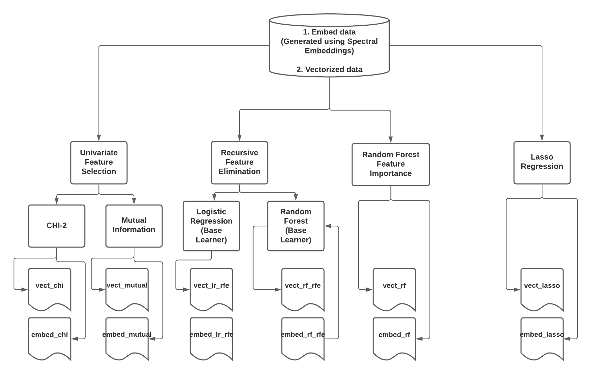

# Feature Ranking and Feature Subset Selection on Multivariate Time Series using Spectral Embeddings
## Setting up Project

Follow these steps to set up the project on your local machine

```shell
git clone https://atharv6f@bitbucket.org/gsudmlab/mvts_fss_ay.git
cd mvts_fss_ay/
python3 -m venv my_venv
source ./my_venv/bin/activate
(my_venv) pip3 install -r ./requirements.txt
```

## Folder Structure
```
  mvts_fss_ay
    ├───data
    │   └───partition1
    │       ├───FL
    │       └───NF
    ├───data_cleaning
    |       ├───utils.py 
    │       └───main.py
    |       └───test.py
    ├───data_modelling
    |       ├───main.py
    ├───feature_selection
    |       ├───pie_rank.py 
    │       └───pie_ss.py 
    |       └───mvts_to_embed.py 
    |       └───comparison.py
    |       └───viz.py
    |       └───main.py
    ├───Papers
    |       ├───Graph_based_2005.pdf
    |       └───Normalized cuts and image Segmentation 
    |       └───A Tutorial on Spectral Clustering
    ├───pet_data
    |        ├───embed.csv 
    |        └───vectorized.csv 
    |        └───scores
    ├─── __init__.py
    ├─── requirements.txt
```

## File Description
* utils.py: Contains helper functions required for cleaning MTS segments and generating vectorized data
* pie_rank.py: Feature Ranking Algorithm from the paper
* pie_ss.py:  Coordinate Descent Solver for Lasso Regression
* mvts_to_embed.py: Generates Spectral Embeddings using RAW MTS segments
* comparison.py:  Comparison of feature ranking/scores using various feature selection algorithms
* viz.py: Contains functions to visualize results
* embed.csv: Pet Embed data generated using 1200 Flare Samples and 1254 Non-Flare Samples.
* vectorized.csv: Pet Vectorized data generated using 1200 Flare Samples and 1254 Non-Flare Samples.
* __init__.py: Main File.

## Feature Selection
Run the following command to simulate the results obtained [here](https://sites.google.com/view/gsu-codesprint-2021/ay)
```angular2html
python __init__.py
```
#### Feature Selection Process

* On running the command above, 12 data frames are generated, each corresponding to the output of the feature selection techniques in the above diagram.

## Report
The report for the project can be found [here](https://sites.google.com/view/gsu-codesprint-2021/ay).